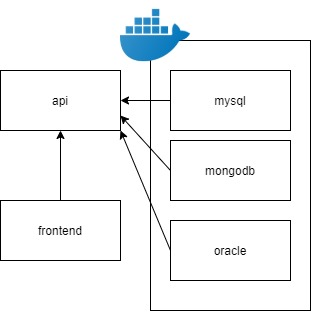
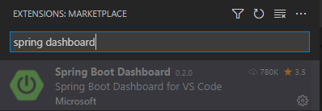

# Docker

## 1. 로컬 개발 하기
## 1-0. 구조.

## 1-1. DB 올리기: docker-compose
### 파일: docker-compose 

```yml
version: "3.3"
services:
  oracle:
    container_name: demo_oracle
    build:
      context: ./oracle/
      dockerfile: Dockerfile
    image: demo/oracle-xe-11g:latest  # 
    environment:
      - ORACLE_ALLOW_REMOTE=true
    ports:
      - "1522:1521"
  mysql:
    container_name: demo_mysql
    command: --character-set-server=utf8 --collation-server=utf8_general_ci
    build:
      context: ./mysql/
      dockerfile: Dockerfile
    image: demo/mysql:5.7
    environment:
      - LC_ALL=C.UTF-8
      - MYSQL_DATABASE=DEMO
      - MYSQL_ROOT_PASSWORD=test1004
    ports:
      - "3306:3306"
  mongodb:
    container_name: demo_mongodb
    build: 
      context: ./mongodb/
      dockerfile: Dockerfile
    image: demo/mongo:3.6
    environment:
      - MONGO_INITDB_ROOT_USERNAME=DEMO_ADMIN
      - MONGO_INITDB_ROOT_PASSWORD=test1004!
      - MONGO_INITDB_DATABASE=demo
    ports:
      - "27018:27017"
```
### 해당 db 3개 올리기
```
docker-compose up -d --build
```
### 해당 db 3개 내리기
```
docker-compose down
```

## 1-2. vscode 설정 
### 로컬에서 run spring boot(vs code)


- .vscode/launch.json
```json
{
    
    "version": "0.2.0",
    "configurations": [
        {
            "type": "java",
            "name": "Debug (Launch) - Current File",
            "request": "launch",
            "mainClass": "${file}"
        },
        {
            "type": "java",
            "name": "Debug (Launch)-SpringbootApplication<docker_local_springboot>",
            "request": "launch",
            "env":{
               "SPRING_PROFILES_ACTIVE": "local" 
            },
            "mainClass": "com.docker_local.springboot.SpringbootApplication",
            "projectName": "docker_local_springboot"
        }
    ]
}
```


## 1-3. 프론트 엔드 올리기
- npm dependencies 다운로드
```sh
cd src/frontend
npm install
```
- 로컬에서 프론트엔드 올리기
```sh
npm run serve
```

## 1-4. hot reload 적용하기
- build.gradle
```
dependencies {
    ...
    developmentOnly 'org.springframework.boot:spring-boot-devtools'
    ...
}
```


## 2. 개발서버 개발하기 (docker 이용)
### 2-1. docker build
- build docker 개발 구조  


- Dockerfile
```Dockerfile
FROM gradle:7.0.2-jdk8 AS build
# copy build.gradle, settings.gradle, src
COPY build.gradle .
COPY settings.gradle .
COPY src src

# gradle boot jar
ARG ENVIRONMENT
RUN gradle -Pprofile=${ENVIRONMENT} bootjar


FROM openjdk:8-jre-slim

# set system environments
ARG ENVIRONMENT
ENV SPRING_PROFILES_ACTIVE=${ENVIRONMENT}
ENV SYSTEM_ENV=${ENVIRONMENT}

# expose 8082
EXPOSE 8082

RUN mkdir /app

# excute java & run spring boot by jar
COPY --from=build /home/gradle/build/libs/*.jar /app/spring-boot-application.jar

ENTRYPOINT ["java", "-Doracle.jdbc.timezoneAsRegion=false", "-Dfile.encoding=UTF-8", "-Djava.security.egd=file:/dev/./urandom","-jar","/app/spring-boot-application.jar"]
```

- build image
```
docker build --build-arg ENVIRONMENT=dev -t test-spring-build:dev .
```
- image

```cmd
REPOSITORY                                                           TAG       IMAGE ID       CREATED          SIZE
test-spring-build                                                    dev       28fad1846c1b   8 minutes ago    238MB
```
### 2-2.  docker run ( -p, --link )

- docker ps
```
CONTAINER ID   IMAGE                        COMMAND                  CREATED         STATUS         PORTS                                                         NAMES
531ee0f52503   demo/oracle-xe-11g:latest    "/bin/sh -c '/usr/sb…"   22 hours ago    Up 22 hours    22/tcp, 8080/tcp, 0.0.0.0:1522->1521/tcp, :::1522->1521/tcp   demo_oracle
ef69c5a328c9   demo/mysql:5.7               "docker-entrypoint.s…"   22 hours ago    Up 22 hours    0.0.0.0:3306->3306/tcp, :::3306->3306/tcp, 33060/tcp          demo_mysql
2d88d7cac345   demo/mongo:3.6               "docker-entrypoint.s…"   22 hours ago    Up 22 hours    0.0.0.0:27018->27017/tcp, :::27018->27017/tcp                 demo_mongodb
```

- docker run
```
docker run -d -p 30080:8082  --name=test-spring \
--network db_default \
--link demo_oracle:demo_oracle \
--link demo_mysql:demo_mysql \
--link demo_mongodb:demo_mongodb \
test-spring-build:dev
```
- -p 내부 8082 포트를 30080포트로
```
- p 30080:8082
```
- --link A:B B컨테이너를 A에 연결한다

```
--link demo_oracle:demo_oracle \
--link demo_mysql:demo_mysql \
--link demo_mongodb:demo_mongodb \
```


# JPA

## Entity 설정
### 1. mysql 
- entity: MySqlContentDao.java
```java
@Entity
@Table(name = "TEST", schema = "DEMO")
@Getter
@Setter
@AllArgsConstructor
@NoArgsConstructor
public class MySqlContentDao extends DbContent {
    @Id
    @GeneratedValue( strategy = GenerationType.IDENTITY)
    @Column(name = "TEST_SEQ_NO")
    private Long id;

    @Column(name = "CONTENT")
    private String content;

}

```
- repository: MongoContentDaoRepository.java
```java
@Repository
public interface MongoContentDaoRepository extends MongoRepository<MongoContentDao, String>{
}
```

### 2. oracle
- entity
```java
@Entity
@Table(name = "TEST_CONTENT", schema = "DEMO")
@Getter
@Setter
@NoArgsConstructor
@AllArgsConstructor
public class OracleContentDao{
    @Id
    @GeneratedValue( strategy = GenerationType.SEQUENCE, generator = "O_TEST_SEQ_NO")
    @Column(name = "TEST_SEQ_NO")
    @SequenceGenerator(sequenceName="DEMO_TEST_SEQ_NO", schema="DEMO", name="O_TEST_SEQ_NO", allocationSize = 1)
    private Long id;

    @Column(name = "CONTENT")
    private String content;
}
```
- repository
```java
@Repository
public interface OracleContentDaoRepository extends CrudRepository<OracleContentDao, Long> {
  
}
```
### 3. mongo

- entity
```java
@Document("test")
@Getter
@Setter
@AllArgsConstructor
@NoArgsConstructor
public class MongoContentDao{
    @Id
    private String id;

    @Field("content")
    private String content;
}

```
- repository
```java
@Repository
public interface MongoContentDaoRepository extends MongoRepository<MongoContentDao, String>{
    
}
```

## repository 이용하기

1. 완전히 다른 DB임에도 형태를 완전히 같은 식으로 이용가능.
- oracle: OracleTestService.java
```java
@Service
public class OracleTestService{

    @Autowired
    OracleContentDaoRepository repo;

    public void add(String content) {
        
        OracleContentDao contentDao = new OracleContentDao();
        contentDao.setContent(content);
        repo.save(contentDao);
        
    }

    public void delete(Long id) {
        
        OracleContentDao contentDao = repo.findById(id).get();
        repo.delete(contentDao);
        
    }

    public void update(Long id, String content) {
        OracleContentDao contentDao = repo.findById(id).get();
        contentDao.setContent(content);
        repo.save(contentDao);
        
    }

    public OracleContentDao get(Long id) {
        OracleContentDao contentDao = repo.findById(id).get();
        return contentDao;
    }

    public List<OracleContentDao> getAll() {
        List<OracleContentDao> dbContents =  new ArrayList<OracleContentDao>();
        repo.findAll().iterator().forEachRemaining(dbContents::add);
        return dbContents;
    }

    
}
```

- mongo: MongoTestService.java

```java
@Service
public class MongoTestService{

    @Autowired
    private MongoContentDaoRepository repo;

    
    public void add(String content) {
        MongoContentDao contentDao = new MongoContentDao();
        contentDao.setContent(content);
        repo.save(contentDao);
        
    }

    
    public void delete(String id) {
        MongoContentDao contentDao = repo.findById(id).get();
        repo.delete(contentDao);
        
    }

    
    public void update(String id, String content) {
        MongoContentDao contentDao = repo.findById(id).get();
        contentDao.setContent(content);
        repo.save(contentDao);
        
    }

    
    public MongoContentDao get(String id) {
        MongoContentDao contentDao =repo.findById(id).get();
        return contentDao;
    }

    
    public List<MongoContentDao> getAll() {
        List<MongoContentDao> dbContents =  new ArrayList<MongoContentDao>();
        repo.findAll().iterator().forEachRemaining(dbContents::add);
        return dbContents;
    }

}
```

